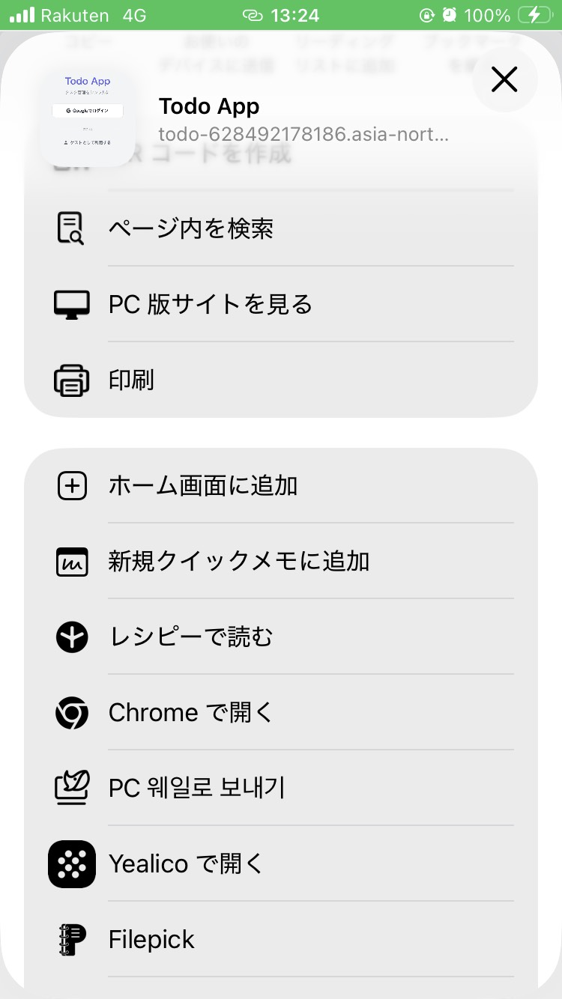
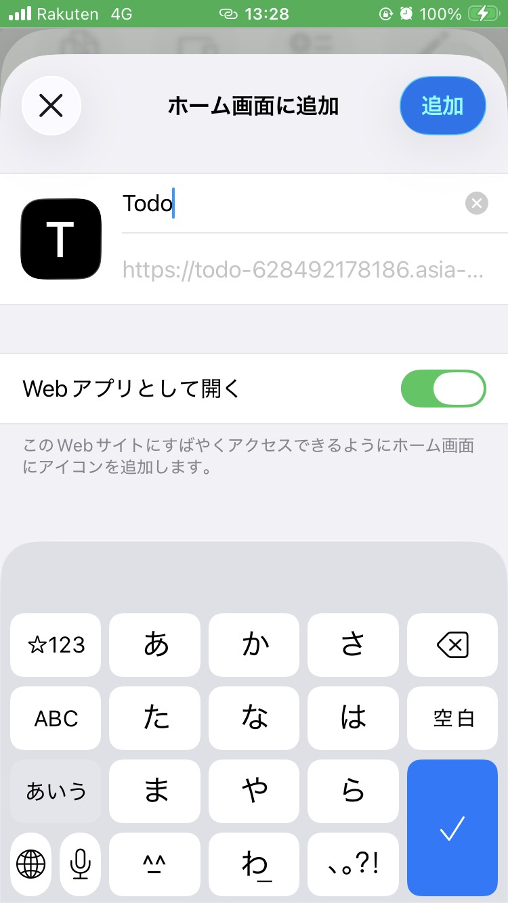

# 実行環境に関する説明資料

このドキュメントでは、ToDoアプリケーションの動作環境、セットアップ手順、および必要な設定について説明します。今回はユーザー毎にTODOのタスク内容を保存するため、Google Cloud Storageを使用し、簡易的なDBを構築しています。

## 1. 動作環境

本アプリケーションは、Google Cloud Run上で稼働しています。

- **本番環境URL**: [https://todo-628492178186.asia-northeast1.run.app/login](https://todo-628492178186.asia-northeast1.run.app/login)

### ログイン方法について

本アプリケーションでは以下の二通りのログイン方法が利用可能です。

1. **Google認証**
   - Googleアカウントを使用してログインします。
   - タスクの保存・同期が利用可能です。
   - **※ 利用にはGoogleアカウントが必要です。**

2. **ゲストログイン（ゲストとして利用する）**
   - アカウントなしで即座にアプリを試すことができます。
   - データは一時的にブラウザに保持されますが、永続化はされません。

## スマートフォンでの閲覧について

本アプリケーションは、スマートフォン用のWebアプリとして動作しています。
下記の手順でホーム画面に追加すると、アプリ感覚で使用できますので推奨します。

※ iOS、GoogleChromeで動作することを確認しております。

1. **ブラウザでアプリを起動する**
   - [https://todo-628492178186.asia-northeast1.run.app/login](https://todo-628492178186.asia-northeast1.run.app/login)にアクセスする

2. **ホーム画面に追加する**
   - ブラウザのメニューを開く
   - "その他"を選択
   - "ホーム画面に追加"を選択
   - "Web アプリとして開く"をON
   - "追加"を押す

 

3. **アプリを起動する**

- ホーム画面に追加したアプリを起動する

## 2. ローカルでの実行について

ローカル環境で確認を行う場合は、**「ゲストアカウント」**での実行を推奨します。
Google認証やCloud Storageの設定（環境変数）を行わずに、すぐにアプリケーションの動作を確認できます。

※ ゲストモードではデータの永続化は行われません（ブラウザリロードでリセットされます）。

### 前提条件

- **Node.js**: v18以上
- **npm**: パッケージ管理ツール

### 手順

1. **受け取ったフォルダへ移動**

   ```bash
   cd todo
   ```

2. **依存関係のインストール**

   ```bash
   npm install
   ```

3. **開発サーバーの起動**

   ```bash
   npm run dev
   ```

4. **動作確認**
   - ブラウザで `http://localhost:3000/login` にアクセスします。
   - **「ゲストとして利用する」** ボタンをクリックしてください。

## 3. 本番環境での実行（参考）

もしGoogle認証やデータ保存（Cloud Storage）を含む完全な動作を確認したい場合は、以下の環境変数の設定が必要です。
設定が複雑なため、通常はゲストモードまたは上記Cloud Run環境での確認をお勧めします。

`.env` または `.env.local` ファイルを作成：

| 変数名                    | 説明                                       |
| :------------------------ | :----------------------------------------- |
| `GOOGLE_CLIENT_ID`        | Google OAuth クライアントID                |
| `GOOGLE_CLIENT_SECRET`    | Google OAuth クライアントシークレット      |
| `NEXTAUTH_SECRET`         | NextAuth用シークレットキー                 |
| `NEXTAUTH_URL`            | http://localhost:3000 or GCP Cloud Run URL |
| `GCS_PROJECT_ID`          | Google Cloud プロジェクトID                |
| `GCS_SERVICE_ACCOUNT_KEY` | GCSサービスアカウントキー (JSON文字列)     |
| `GCS_BUCKET_NAME`         | GCSバケット名                              |

## 4. プロジェクト構成

- **フレームワーク**: Next.js 16 (App Router)
- **言語**: TypeScript
- **スタイリング**: Material UI (MUI), Framer Motion
- **認証**: NextAuth, GoogleOauth2
- **DB**: Google Cloud Storage

## 5. DBについて

今回はユーザー毎にTODOのタスク内容を保存するため、Google Cloud Storageを使用し、簡易的なDBを構築しています。

Google Cloud Storageのバケットの中に、ユーザー毎に「メールアドレス.json」を作成し、そのjsonにタスクの内容を保存編集しています。

例：

```json
[
  {
    "title": "課題1",
    "description": "TODOアプリ作成",
    "priority": "high",
    "deadline": "2025/12/26",
    "id": "5e9bd7aa-5e09-43be-8a89-b1a849b1405a",
    "completed": false,
    "createdAt": "2025-12-22T08:55:42.203Z",
    "order": 0,
    "subtasks": [
      {
        "id": "785f4442-b274-422b-9a13-2e0c8e15ebec",
        "title": "TODOアプリ作成",
        "completed": false
      },
      {
        "id": "5381991a-2e78-4085-84f2-27f85d3162d8",
        "title": "課題に関する補足説明資料（任意）",
        "completed": false
      },
      {
        "id": "1794b0e6-a909-4ddc-a644-a87f86b339c5",
        "title": "実行環境に関する説明資料",
        "completed": false
      },
      {
        "id": "c607014e-78fb-46cc-8902-cdbff3ea493b",
        "title": "サブタスク編集しやすくする",
        "completed": true
      },
      {
        "id": "cbc0bf88-3663-4124-ab40-62b75a29586f",
        "title": "ヘルプ、アプリについての追加",
        "completed": false
      },
      {
        "id": "29885bff-e42a-48ac-910e-146d5f69d6be",
        "title": "共有機能の追加",
        "completed": false
      }
    ]
  },
  {
    "title": "課題2",
    "description": "ゲーム紹介HTML作成",
    "priority": "high",
    "deadline": "2025-12-31",
    "id": "62ccb669-8063-4a17-9a3a-eb6ab64b5e71",
    "completed": false,
    "createdAt": "2025-12-22T08:58:00.863Z",
    "order": 1,
    "subtasks": [
      {
        "id": "54c91990-817f-4aeb-99af-e96d86ab4335",
        "title": "課題に関する補足説明資料（任意）",
        "completed": false
      },
      {
        "id": "f9c9abb4-729b-498b-b36c-1ea23471985b",
        "title": "実行環境に関する説明資料",
        "completed": false
      },
      {
        "id": "1766393928668",
        "title": "ゲーム紹介HTML作成",
        "completed": false
      }
    ]
  },
  {
    "title": "課題3",
    "description": "UI/UXについて",
    "priority": "high",
    "deadline": "2026-01-02",
    "id": "e60ff7de-0751-457f-af58-3a2741fcbd11",
    "completed": false,
    "createdAt": "2025-12-22T08:56:38.288Z",
    "order": 2,
    "subtasks": [
      {
        "id": "d27692c2-1883-43f9-aaf0-03a96fd89702",
        "title": "Q.UX/UIの近年の変化について",
        "completed": false
      },
      {
        "id": "1766394058955",
        "title": "Q.最近、共感したデザインや製品",
        "completed": false
      }
    ]
  }
]
```
